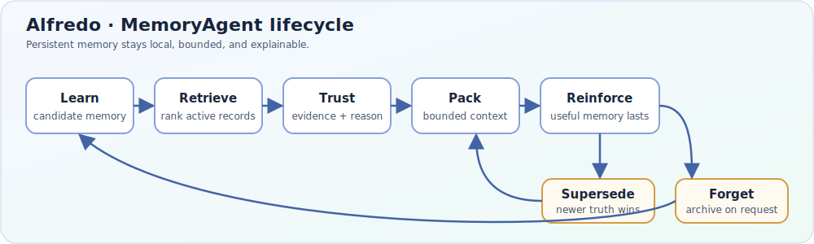

# Alfredo — MemoryAgent



> **A local MemoryAgent that learns, remembers, forgets, and explains what it recalls.**
> Alfredo keeps a durable, selective memory for an agent without turning your data into a hosted SaaS.

**Start here:** [GitHub quickstart](#quickstart-from-github) · [lifecycle demo](examples/demo_lifecycle.py) · [MCP and Python integration](INTEGRATION.md) · [synthetic benchmark](#benchmark-evidence)

---

## What Alfredo is

Alfredo is a Python SDK and CLI for a local memory layer. Its native store is SQLite, the distribution name is `alfredo-memory-agent`, and the import namespace is `memory_agent`. You run it beside your agent and choose where its vault lives; there is no Alfredo-hosted dashboard, tenant service, billing account, or required remote memory API.

A conversation transcript is not a memory policy. Raw history grows without a bounded selection step, while a simple RAG index can return semantically similar text without deciding whether it is trusted, stale, superseded, or safe to pack into a prompt. Alfredo makes those decisions explicit and inspectable:

- **Namespaces** keep records and sessions scoped to an agent or tenant boundary.
- **Evidence** records score, matching signals, trust, and a reason for each retrieval decision.
- **Selected and dropped IDs** show what entered the bounded recall packet and what did not.
- **Lifecycle state** makes reinforcement, supersession, archival, and explicit forgetting visible.

These are SDK behaviors, not a promise of automatic compliance or production security. Configure storage, access control, retention, and deployment isolation for your environment.

## Quickstart from GitHub

These are the complete steps for a fresh machine with no local checkout.

### Windows PowerShell

```powershell
git clone https://github.com/AkiraTokashiki/Memo-Memory-Agent.git
cd Memo-Memory-Agent
python -m venv .venv
.\.venv\Scripts\Activate.ps1
python -m pip install --upgrade pip
python -m pip install -e ".[semantic,mcp]"
alfredo --offline quickstart
```

### macOS/Linux

```bash
git clone https://github.com/AkiraTokashiki/Memo-Memory-Agent.git
cd Memo-Memory-Agent
python3 -m venv .venv
source .venv/bin/activate
python -m pip install --upgrade pip
python -m pip install -e ".[semantic,mcp]"
alfredo --offline quickstart
```

For an installed release, the canonical package shortcut is also supported:

```bash
pip install alfredo-memory-agent
alfredo --offline quickstart
```

The offline quickstart uses deterministic local embeddings and does not need an API key, network request, or model download. The optional `semantic` extra enables model-backed embeddings; `mcp` enables the MCP server and local client setup. The native SQLite vault is stored under `.alfredo/` in a checkout or under Alfredo's platform application-data directory after installation. Set `ALFREDO_HOME` to choose another vault location.

Run the one-time setup wizard after installation:

```console
alfredo setup          # retention, namespace, user ID, MCP clients
alfredo mcp setup      # inspect/configure Claude, Cursor, VS Code, Hermes
alfredo doctor         # dependency, path, and MCP diagnostics
alfredo doctor --mcp   # MCP-only diagnostics
alfredo version        # installed version
```

MCP configuration is read-only until you confirm each client. Alfredo preserves unrelated servers, creates a `.bak` backup, writes atomically, and leaves the original file untouched if a write fails. Unsupported formats receive a manual snippet. `alfredo mcp` without `setup` continues to start the MCP server.

The module entry point is equivalent:

```bash
python -m memory_agent --offline quickstart
```

## Lifecycle: from learning to an explainable packet

Conceptually, Alfredo's lifecycle can be summarized as:

1. **Learn** — extract a candidate preference, fact, or interaction with namespace and provenance.
2. **Retrieve** — search active records and rank candidates using configured retrieval signals.
3. **Trust** — evaluate confidence and attach evidence before context inclusion.
4. **Pack** — build a bounded recall packet exposing `selected_ids` and `dropped_ids`.
5. **Reinforce** — strengthen useful memories while forgetting decay reduces stale strength.
6. **Supersede / forget** — replace changed preferences or archive explicit forget requests.

Run the deterministic walkthrough with:

```bash
python examples/demo_lifecycle.py
```

The demo covers cross-session recall, preference supersession, and bounded trusted context without network access, model downloads, API keys, or wall-clock output. See [the architecture lifecycle](docs/ARCHITECTURE.md#real-lifecycle) and [the integration guide](INTEGRATION.md).

## Why it is different

| Approach | What it keeps | What it does not decide | What Alfredo adds |
| --- | --- | --- | --- |
| Raw conversation history | The transcript | Which facts are current, trusted, or within budget | Candidate extraction, lifecycle state, bounded packets, and explicit forget/supersede operations |
| Simple semantic RAG | Indexed chunks ranked by similarity | Whether a result is low-confidence, stale, superseded, or safe for context | Trust evidence, namespace-aware retrieval, selected/dropped IDs, and reinforcement/decay |
| Alfredo MemoryAgent | Structured local memories in a SQLite vault | Your deployment's access-control and privacy obligations | A local, inspectable learn → retrieve → trust → pack → reinforce → supersede/forget lifecycle |

## Agentic memory primitives

Alfredo exposes higher-level primitives without replacing the SQLite core:

- **Typed relations** — `MemoryRelation` edges such as `supports`, `supersedes`, and `contradicts`.
- **Proposal-first evolution** — `EvolutionProposal` and `EvolutionDecision` validate changes before atomic mutation.
- **Procedural task packs** — task-specific triggers, instructions, constraints, required memory IDs, and examples.
- **Episodic consolidation** — deterministic summaries with idempotency keys.

The public SDK exports these building blocks from `memory_agent`. Planner output is never a direct state mutation.

## Inspectable Markdown export

SQLite remains the source of truth, while active memories can be projected into deterministic Markdown:

```bash
alfredo --db .alfredo/memory_agent.db export-markdown \
  --namespace tenant-a \
  --output .alfredo/markdown/tenant-a
```

Export is read-only, repeatable, and never crosses namespace boundaries. See [`docs/PROVENANCE.md`](docs/PROVENANCE.md).

## Architecture in brief

```text
agent input
    │
    ▼
MemoryAgent orchestrator ──► extraction/consolidation ──► namespace-scoped SQLite vault
    │                                  │                           │
    │                                  └─ reinforce/supersede/forget┘
    ▼
retrieval ──► typed relations + trust policy + evidence ──► bounded recall packet
    │                                                        (selected_ids, dropped_ids)
    ▼
agent context / response
```

## Benchmark evidence

The [Alfredo Vault fixtures](benchmarks/alfredos_vault/) are **synthetic** comparison data for reproducible local checks. They exercise temporal recall, updated versus archived memories, explicit forgetting, low-confidence abstention, sensitive-memory boundaries, and prompt-injection handling across checked-in strategies (`raw-history`, `semantic-rag`, and `Alfredo`).

This benchmark is **not a security or privacy audit**, is not production data, and does not establish that a deployment is safe for secrets or regulated workloads. Results depend on the fixture, configuration, and offline run; validate your own data, policies, and threat model.

Run the comparison from a checkout:

```bash
python -m memory_agent --offline benchmark compare \
  --users benchmarks/alfredos_vault/users.json \
  --memories benchmarks/alfredos_vault/memories.jsonl \
  --questions benchmarks/alfredos_vault/evaluation_questions.jsonl \
  --report .alfredo/benchmark-comparison.json \
  --seed 42 --run local-offline
```

## Integration and community

- [Lifecycle demo](examples/demo_lifecycle.py) — deterministic adoption path.
- [MCP and Python integration](INTEGRATION.md) — stdio/HTTP server setup, namespaces, evidence, and providers.
- [Benchmark fixtures and reports](benchmarks/alfredos_vault/) — synthetic inputs and generated outputs.
- [Provenance and export boundary](docs/PROVENANCE.md) — Markdown projection and licenses.
- [License](LICENSE) — MIT terms.
- [Security policy](SECURITY.md) — security reporting and deployment guidance.
- [Contributing](CONTRIBUTING.md) — development and review workflow.

Alfredo is released under the [MIT License](LICENSE).
