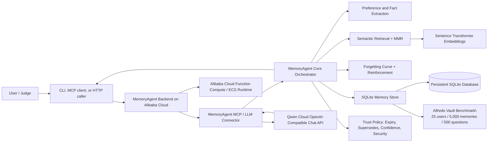

# MemoryAgent Architecture

MemoryAgent is submitted to **Track 1: MemoryAgent** of the Global AI Hackathon Series with Qwen Cloud.

The project provides persistent, cross-session memory for an AI agent. It stores user preferences, facts, and interaction summaries in SQLite, retrieves relevant memories with semantic embeddings and multi-factor ranking, reinforces useful memories, archives stale memories through a forgetting curve, and includes a synthetic vault benchmark for sustained-memory behavior.

Rendered diagram asset: [`docs/architecture.svg`](./architecture.svg).

## System diagram



## Runtime flow

1. The user sends a message through the CLI, MCP client, or deployed backend endpoint.
2. MemoryAgent extracts candidate memories such as preferences, habits, and facts.
3. The retrieval engine searches active memories using semantic similarity, recency, importance, and recall strength.
4. Retrieved memories are formatted into a bounded context block for Qwen Cloud.
5. Qwen Cloud generates the response using the current message plus memory context.
6. MemoryAgent stores the interaction, reinforces memories that were recalled, and decays stale memories.
7. Across later sessions, the same database lets the agent recall previous preferences and avoid filling the context window with irrelevant history.
8. For benchmark runs, the same SQLite vault is seeded from synthetic JSON/JSONL data and evaluated against 500 questions that test temporal recall, contradiction updates, ignored-memory filtering, low-confidence abstention, and prompt-injection resistance.

## Core components

| Component | Path | Responsibility |
| --- | --- | --- |
| Orchestrator | `src/memory_agent/agent/orchestrator.py` | Runs perceive → extract → retrieve → memorize → decay. |
| Decision extraction | `src/memory_agent/agent/decision.py` | Extracts preferences, facts, and habits from natural language. |
| Store | `src/memory_agent/core/memory_store.py` | Persists memories, embeddings, tags, and sessions in SQLite. |
| Retrieval | `src/memory_agent/core/retrieval.py` | Ranks memories with semantic score, recency, importance, strength, and MMR diversity. |
| Forgetting | `src/memory_agent/core/forgetting.py` | Applies Ebbinghaus decay and reinforcement. |
| LLM connector | `src/memory_agent/integrations/llm_connector.py` | Sends memory-augmented prompts to Qwen Cloud or another OpenAI-compatible provider. |
| Alibaba proof | `deploy/alibaba_cloud_proof.py` | Demonstrates the deployment/runtime checks for Alibaba Cloud and Qwen Cloud APIs. |
| Vault benchmark | `src/memory_agent/benchmark.py` | Loads synthetic benchmark data, seeds SQLite, evaluates trust-policy questions, and writes reports. |

## Alibaba Cloud deployment target

The backend can be deployed to Alibaba Cloud Function Compute or ECS. The required proof recording should show:

1. the Alibaba Cloud console resource running;
2. the deployed endpoint or runtime invocation;
3. a call that reaches MemoryAgent;
4. the deployment proof command from `deploy/alibaba_cloud_proof.py` checking Alibaba Cloud Function Compute and Qwen Cloud API connectivity.

## Qwen Cloud integration

The LLM connector uses Qwen Cloud's OpenAI-compatible chat endpoint:

```text
https://dashscope.aliyuncs.com/compatible-mode/v1/chat/completions
```

Use `DASHSCOPE_API_KEY` in the deployed environment.
## Public contracts and provider boundaries

`MemoryAgent` is the stable facade. Storage, embedding, retrieval and trust
providers are injected through small protocols; adapters never reimplement
the memory lifecycle. SQLite is the default durable store. Provider name and
dimension are checked before cosine similarity, so callers must reindex or
use a separate database when providers differ.

Retrieval returns explainable evidence: component scores, matched signals,
trust classification, reason, selected IDs, dropped IDs and bounded-context
accounting. A single perceive cycle commits through the store port after trust
filtering, reinforcement and archival decisions complete.

## Reproducible benchmark

Run the offline comparison from the README with the checked-in synthetic
fixtures. The report includes raw-history, semantic-RAG and Alfredo baselines,
dataset/config hashes, seed/run identifiers, security events, context size and
latency p50/p95. User records must carry `synthetic: true`; this marker is a
benchmark input contract and is not a substitute for privacy review of data.
